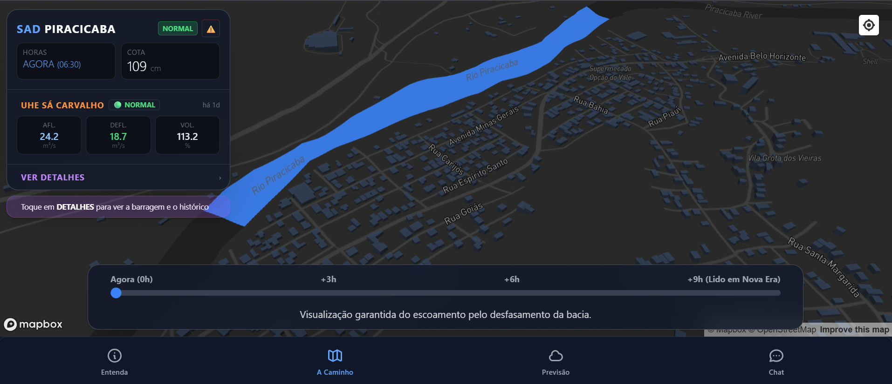
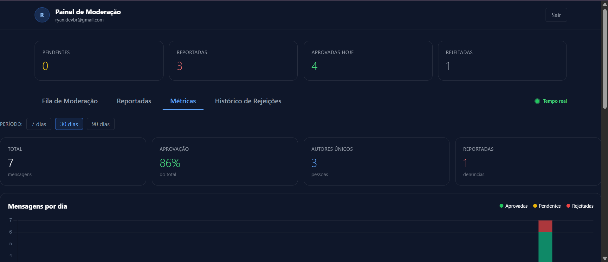
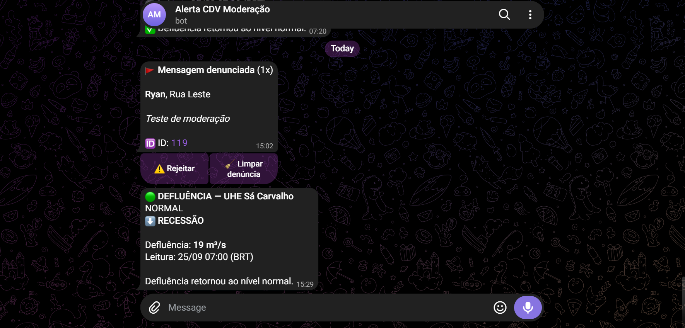

# Alerta Enchente CDV
## Sistema de Apoio à Decisão

Sistema de alerta antecipado de cheias do Rio Piracicaba em Cachoeira do Vale (Timóteo/MG).

[](LICENSE)
[]()
[](https://alertaenchentecdv.app)

---

## Sobre o projeto

A comunidade de Cachoeira do Vale, em Timóteo (MG), sofre com cheias periódicas do Rio Piracicaba. As ferramentas públicas disponíveis hoje avisam a população apenas quando a água já está na cota de inundação, o que não dá tempo hábil para moradores retirarem móveis, documentos ou evacuarem.

Este sistema resolve esse problema monitorando o rio em pontos a montante do bairro e disparando alertas com até 10 horas de antecedência.

O projeto combina três fontes de dados:

- Estações fluviométricas da ANA (Agência Nacional de Águas)
- Dados operacionais da UHE Sá Carvalho, da CEMIG, obtidos por coleta automatizada
- Previsão de chuva via Open-Meteo

E entrega o resultado em três canais:

- Site público responsivo com mapa 3D e chat comunitário
- Bot do Telegram com alertas automáticos para a Defesa Civil
- Painel web para moderação do chat e acompanhamento de métricas

---

## Status

Sistema em operação desde setembro de 2026. Todas as funcionalidades principais estão implementadas:

- Ingestão automatizada de dados da ANA e da CEMIG
- Cache de estado consumido pelo site público
- Alertas automáticos por faixa de cota no Telegram
- Monitoramento de saúde do pipeline
- Chat comunitário com moderação
- Dashboard de métricas de engajamento
- Comparativo histórico e gráfico de defluência
- Progressive Web App (instalável)

Itens pendentes:

- Finalização da infraestrutura de push notifications no navegador

---

## Screenshots

### Site público — aba "A Caminho"



### Painel de moderação



### Alertas no Telegram



---

## Como funciona

### Fluxo de dados

```
Fontes externas                 GitHub Actions
-----------------               --------------
API ANA        ----->  atualizador_tempo_real.py  ----->  historico_ana
Site CEMIG     ----->  coletor_cemig.py           ----->  historico_cemig
                                                     |
                                                     v
                                       atualizador_cache_site.py  ----->  cache_site
                                                     |
                                          -------------+-------------
                                          |                         |
                                          v                         v
                                alertas_qualitativos.py    monitor_saude.py
                                          |                         |
                                          +------------+------------+
                                                       |
                                                       v
                                                    Telegram
```

### Tempo de trânsito

Uma onda de cheia leva entre 9 e 10 horas para percorrer o trecho entre Nova Era (montante) e Timóteo (jusante). O sistema usa esse tempo para avisar a população com antecedência.

O estudo hidrológico completo que fundamenta esse valor está na seção 5 da documentação técnica.

### Alertas qualitativos

Devido a presença de três barragens entre as duas estações (Guilman Amorim, Sá Carvalho e Cocais Grande), a previsão numérica de nível em centímetros se mostrou inviável. O sistema opera então com alertas por faixa:

| Nível em Timóteo | Faixa | Ação |
|------------------|-------|------|
| Abaixo de 780 cm | Normal | Nenhuma |
| 780 a 889 cm | Alerta | Notificação no Telegram |
| 890 cm ou mais | Crítico | Notificação com prioridade máxima |

Além disso, o sistema monitora a defluência da UHE Sá Carvalho. Quando a CEMIG abre as comportas, uma onda adicional desce o rio e chega a Cachoeira do Vale em cerca de 4 horas.

---

## Stack

| Camada | Tecnologia |
|--------|------------|
| Backend de dados | Supabase (PostgreSQL + Realtime + Auth + Edge Functions) |
| Frontend | HTML, Tailwind CSS, JavaScript puro |
| Mapas | Mapbox GL JS |
| Gráficos | Chart.js |
| Automação | GitHub Actions |
| Notificações | Telegram Bot API |
| Hospedagem do site | Vercel |
| Scraping CEMIG | Playwright |

---

## Estrutura do repositório

```
Alerta Enchente - CDV/
├── .github/workflows/          Automação no GitHub Actions
├── docs/
│   ├── DOCUMENTACAO.md         Documentação técnica completa
│   ├── estudos/                Scripts de análise hidrológica
│   ├── ferramentas/            Utilitários manuais
│   └── imagens/                Screenshots para o README
├── supabase/functions/         Edge Functions (Telegram, push)
├── atualizador_tempo_real.py   Ingestão de dados da ANA
├── coletor_cemig.py            Coleta de dados da CEMIG
├── atualizador_cache_site.py   Cálculo do cache consumido pelo site
├── alertas_qualitativos.py     Alertas por faixa de cota
├── monitor_saude.py            Monitoramento de saúde do pipeline
├── index_base.html             Template do site público
├── moderacao.html              Painel de moderação
├── manifest.json               Configuração PWA
├── sw.js                       Service Worker
├── requirements.txt            Dependências Python
├── .env.example                Modelo de variáveis de ambiente
└── README.md
```

---

## Rodando localmente

### Pré-requisitos

- Python 3.11 ou superior
- Node.js (para a CLI do Supabase, opcional)
- Conta no Supabase com o banco configurado
- Credenciais de acesso à API da ANA

### Instalação

```bash
# Clonar o repositório
git clone https://github.com/ryandevbr/Alerta_Enchente_CDV.git
cd Alerta_Enchente_CDV

# Criar e ativar ambiente virtual
python -m venv venv
source venv/bin/activate        # Linux/Mac
.\venv\Scripts\Activate.ps1     # Windows PowerShell

# Instalar dependências Python
pip install -r requirements.txt
playwright install chromium

# Configurar variáveis de ambiente
cp .env.example .env
# Editar .env com suas credenciais
```

### Executando os scripts

```bash
# Ingestão de dados da ANA
python atualizador_tempo_real.py

# Coleta de dados da CEMIG
python coletor_cemig.py

# Cálculo do cache do site
python atualizador_cache_site.py

# Verificação de alertas
python alertas_qualitativos.py

# Monitoramento de saúde
python monitor_saude.py
```

### Rodando o site localmente

```bash
# O script abaixo injeta as chaves do .env no HTML e inicia um servidor local
python docs/ferramentas/servidor_local.py
```

O site ficará acessível em `http://localhost:8000`.

---

## Deploy

O projeto usa três serviços em produção:

### 1. Supabase

- Banco de dados PostgreSQL
- Autenticação para o painel de moderação
- Realtime para o chat comunitário
- Edge Functions para os webhooks do Telegram

### 2. Vercel

- Hospedagem dos arquivos estáticos (`index_base.html`, `moderacao.html`)
- Deploy automático a cada push no branch `main`

### 3. GitHub Actions

- Execução agendada dos scripts de ingestão e alertas
- Também disparável manualmente pelo Telegram

O passo a passo completo de configuração de cada serviço está na seção 14 da documentação técnica.

---

## Variáveis de ambiente

O arquivo `.env` deve conter:

```env
# Supabase
SUPABASE_URL=
SUPABASE_KEY=

# ANA (Agência Nacional de Águas)
ANA_USER=
ANA_PASS=

# Telegram
TELEGRAM_TOKEN=
TELEGRAM_CHAT_ID=
TELEGRAM_WEBHOOK_SECRET=

# GitHub (para disparo de workflows via Telegram)
GITHUB_TOKEN=
GITHUB_REPO=
GITHUB_WORKFLOW=

# Push notifications
VAPID_PUBLIC_KEY=
VAPID_PRIVATE_KEY=
VAPID_SUBJECT=
PUSH_SECRET=

# Mapbox (usada no frontend)
MAPBOX_KEY=
```

Nunca versione o arquivo `.env`. Ele está listado no `.gitignore`.

---

## Replicando em outra cidade

O sistema foi projetado para ser adaptável a outras bacias hidrográficas. Para replicar, é necessário substituir:

- Códigos das estações da ANA (as do Rio Piracicaba não servem para outros rios)
- Limiares de cota e defluência conforme a régua local
- Lag de trânsito da onda (calcular com o script de validação incluso em `docs/estudos/`)
- Coordenadas do Mapbox e polígonos da mancha de inundação
- Textos e logo do site
- Credenciais de todos os serviços

O checklist completo está na seção 14 da documentação técnica, junto com o passo a passo de cada integração.

---

## Documentação técnica

A documentação completa cobre em detalhe:

- Arquitetura geral do sistema
- Cada fonte de dados (ANA, CEMIG, Open-Meteo)
- Estudo hidrológico do tempo de trânsito
- Schema do banco de dados
- Cada script Python individualmente
- Edge Functions do Supabase
- Estrutura do frontend
- Automação via GitHub Actions
- Considerações de segurança
- Manual de operação para a Defesa Civil
- Guia de replicação

Consulte: [docs/DOCUMENTACAO.md](docs/DOCUMENTACAO.md)

---

## Como contribuir

Contribuições são bem-vindas. Algumas formas de ajudar:

- Reportar problemas ou sugerir melhorias via issues
- Enviar correções e melhorias via pull requests
- Adaptar o sistema para outras bacias hidrográficas
- Traduzir a documentação para outros idiomas

Antes de abrir um pull request, verifique se o código segue o estilo do projeto e se os testes manuais continuam passando.

---

## Aviso legal

Este sistema é uma ferramenta de apoio à decisão. As projeções e alertas são gerados a partir de dados públicos das estações da ANA e da CEMIG, e podem conter imprecisões ou atrasos.

O Alerta Enchente CDV não substitui os canais oficiais de alerta nem a avaliação técnica da Defesa Civil Municipal. A decisão de evacuação é de responsabilidade exclusiva das autoridades competentes. Em situação de emergência, siga sempre as orientações oficiais e ligue 199 (Defesa Civil) ou 193 (Corpo de Bombeiros).

## Licença

Este projeto é distribuído sob a licença MIT. Você pode usar, modificar, distribuir e sublicenciar livremente, inclusive em produtos comerciais, desde que mantenha o aviso de copyright original.

Consulte o arquivo [LICENSE](LICENSE) para o texto completo.

---

## Créditos

Autor: Ryan Lucas de Freitas Martins ([@ryandevbr](https://github.com/ryandevbr))

Fontes de dados:

- ANA (Agência Nacional de Águas e Saneamento Básico) — HidroWebService
- CEMIG (Companhia Energética de Minas Gerais) — UHE Sá Carvalho
- Open-Meteo — previsão meteorológica

---

## Contato

Para dúvidas, sugestões ou suporte à replicação:

- Issues do GitHub: [abrir issue](https://github.com/ryandevbr/Alerta_Enchente_CDV/issues)
- Site em produção: [alertaenchentecdv.app](https://alertaenchentecdv.app)
